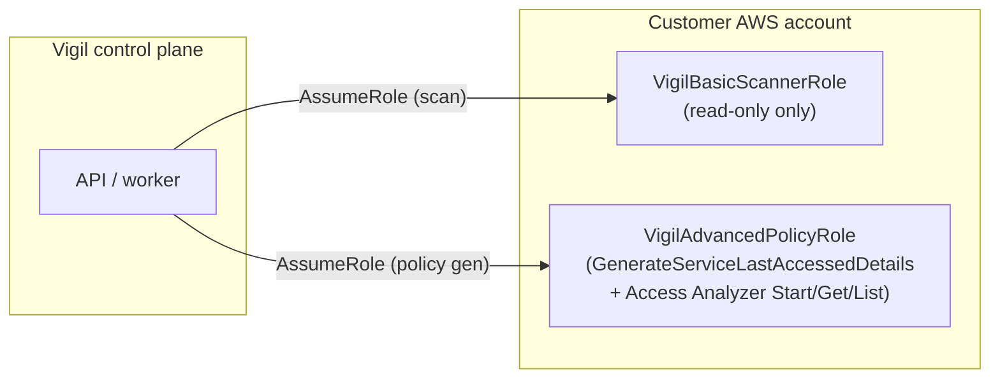
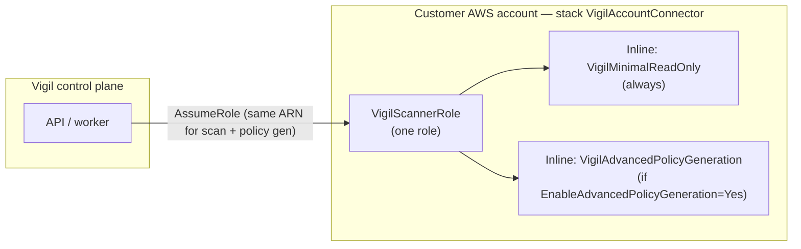

# Deepsearch v6 — read-only posture, policy generation, CIS 1.11

**Source:** `deepsearch/v6.txt` (security/architecture audit, 2026-05).  
**Related:** [deepsearch-v4-map.md](./deepsearch-v4-map.md), [policy-generator-iam-last-accessed.md](./policy-generator-iam-last-accessed.md), [cis-v5-40-controls.md](./cis-v5-40-controls.md)

---

## Executive alignment

| v6 theme | Vigil decision |
|----------|----------------|
| Core compliance scan is read-only | **Yes** — collectors/checks are List/Get/Describe only |
| Policy-gen uses “write-like” IAM APIs (jobs, not resource mutation) | **Yes** — optional; gated by `EnableAdvancedPolicyGeneration` |
| Do not drop used services when telemetry is thin | **Done** — `iam_usage.py` + collector fixes |
| CIS 1.11 scorable from read-only data | **Yes** — IAM policies + last-used; no AA required for pass/fail |
| Split into two IAM roles (basic vs advanced) | **Not adopted** — see [Connector architecture](#connector-architecture-unified-vs-v6-split) |
| Vigil calls `StartPolicyGeneration` from the app | **Partial** — permissions + CFN yes; **API only reads completed jobs** today |
| GitHub IaC triggers | **Done** — webhooks/PR scan; no shipped EventBridge stack |

---

## Connector architecture: unified vs v6 split

v6 suggested **two roles** so the default connector stays strictly read-only and policy analysis is opt-in on a second role.

### v6 diagram (not what we ship)

- **Two Role ARNs** to paste/configure.
- Scanner never has `StartPolicyGeneration` on its role.

### What Vigil ships (current)

| Piece | Path |
|-------|------|
| Parent stack | `infra/cfn/vigil-stack.yaml` |
| Connector role | `infra/cfn/vigil-core-scanner.yaml` → `VigilScannerRole` |
| Optional policy-gen permissions | Same role, conditional policy `VigilAdvancedPolicyGeneration` |
| Legacy split-stack | `VigilReadOnlyScannerRole` → `VigilPolicyGenerationRole` mapped in `derive_advanced_role_arn()` |

**Why unified:** one Role ARN in onboarding, one ExternalId, capability verify on that role. Advanced is a **stack parameter + inline policy**, not a second connector.

**When v6 split still matters:** auditors who want zero job-start APIs on the role used for daily scans. Today that is a **documentation / trust** distinction (base policy has no Start*), not a second ARN.

---

## IAM actions: CFN vs runtime

### On the connector (when Policy Generation enabled)

| Action | In CFN (`vigil-core-scanner.yaml`) | Used by Vigil today |
|--------|-------------------------------------|---------------------|
| `iam:GenerateServiceLastAccessedDetails` | Yes (advanced inline) | **Yes** — `collectors/last_accessed.py` on each scan |
| `iam:GetServiceLastAccessedDetails` | Yes | **Yes** — poll job after generate |
| `access-analyzer:ListAnalyzers` | Yes (base read) | **Yes** — `collect_access_analyzer` |
| `access-analyzer:ListPolicyGenerations` | Yes (advanced) | **Yes** — `fetch_latest_generated_policy()` |
| `access-analyzer:GetGeneratedPolicy` | Yes (advanced) | **Yes** — after job succeeds |
| `access-analyzer:StartPolicyGeneration` | Yes (advanced) | **No** — not called from API yet |
| `access-analyzer:CancelPolicyGeneration` | Yes (advanced) | **No** — verify only |

Capability verify: `account_capabilities.py` → `ADVANCED_POLICY_ACTIONS` (includes `ListPolicyGenerations`).

### Policy drawer API (`GET …/roles/generated-policy?advanced=true`)

1. IAM last-accessed from DB (`iam_perm_usage`) — always.
2. If `advanced=true`: `_resolve_advanced_policy_generation()` assumes connector role, loops regions, calls **`fetch_latest_generated_policy`** (latest **SUCCEEDED** job only).
3. Does **not** call `StartPolicyGeneration` inline (docstring: read-only product choice — no blocking minutes in request).

**Implication:** Deploying CFN with the four actions you listed is **necessary but not sufficient** for **high confidence + resource ARNs** in the drawer. You also need a **completed** Access Analyzer policy-generation job per role (Console today, or future Vigil-triggered job).

---

## Access Analyzer — what’s left to finish

| Step | Status |
|------|--------|
| CFN `EnableAdvancedPolicyGeneration=Yes` + stack update | **Customer** — you did this |
| Accounts UI: enable capability + verify permissions | **Customer** |
| Re-scan (populate `access_analyzers`, refresh `iam_perm_usage`) | **Customer** |
| IAM Access Analyzer enabled in regions | **Customer** |
| Completed AA policy-gen job per role | **Gap** — Vigil does not start jobs; reads existing SUCCEEDED only |
| UI: `advanced=true` when capability on | **Done** — auto when deployed |
| UI: clear note when no completed job | **Done** — `advanced_note` / confidence copy |
| Optional: Vigil calls `StartPolicyGeneration` + poll until SUCCEEDED | **Not built** — closes “manual Console job” gap |
| Optional: `EnableAccessAnalyzerMonitorRole` + CloudTrail bucket (legacy template) | **Separate** — AA service reading trail S3; not the four actions you listed |

---

## Policy drawer — confidence + warnings

| Item | Status |
|------|--------|
| high / medium / low + coverage (Actions / Resources) | **Done** |
| Service-level preserve + warning (no silent drop) | **Done** |
| `advanced_note` when AA unavailable / no job | **Done** |
| Auto `advanced=true` when capability deployed | **Done** |
| What If tab + blast radius (`supportsBlastRadius`) | **Done** (incl. `iam.role.full_admin_policy`) |
| Resource ARNs in suggested policy diff | **Needs completed AA job** (or implement Start + poll) |
| Start AA job from drawer (“Generate & wait”) | **Not built** |
| Hide misleading “enable AA” when capability already on | **Done** (warning copy updated) |

---

## CIS 1.11 — detection vs remediation

**CIS 1.11:** *Ensure credentials unused for **45 days** or greater are disabled.*

| Layer | Status |
|-------|--------|
| **Detection** | **Automated** — `iam.user.credentials_unused_45d`, `iam.access_key.unused_45d` (45-day threshold) |
| **Remediation** | **Manual** — Vigil is read-only; matrix `remediation_status: manual` |

**Supporting hygiene (not CIS 1.11):** `iam.user.inactive_90d`, `iam.access_key.unused_90d` stay mapped to SOC2/ISO only.

Matrix: `api/data/cis_v5_level1_matrix.json` → `"vigil_status": "automated"` for 1.11.

---

## Operational checklist (from v6)

- [ ] Re-scan after policy-gen CFN update (refresh last-accessed + analyzers).
- [ ] Verify capabilities on Accounts (all advanced actions green, including `ListPolicyGenerations`).
- [ ] For a test role: run AA “Generate policy from CloudTrail” in Console **or** implement API Start + poll.
- [ ] Open finding → Remediation → Suggested policy → confirm high confidence when job exists.
- [x] CIS 1.11: 45d checks + automated matrix status (remediation remains manual).

---

## Deferred / won’t do (unless asked)

| v6 item | Status |
|---------|--------|
| Second IAM role ARN (v6 split) | **Won’t do** — unified connector is product model |
| EventBridge IaC trigger in CFN | **Won’t do** — GitHub path only |
| SSM runbooks | v4 defer |

---

## Session log

Documented in HANDOFF **Session 30** (2026-05-30): v6 map, Accounts/Controls/What If UX from same period, policy-gen clarify.
